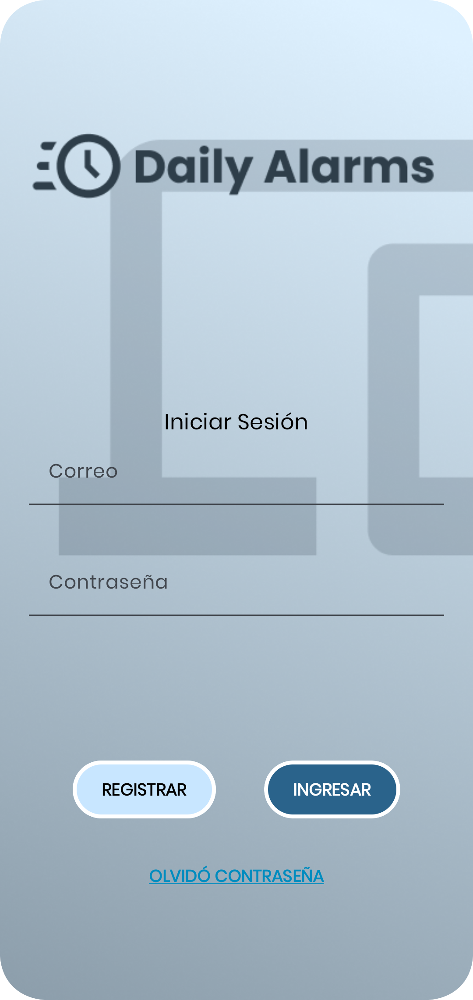
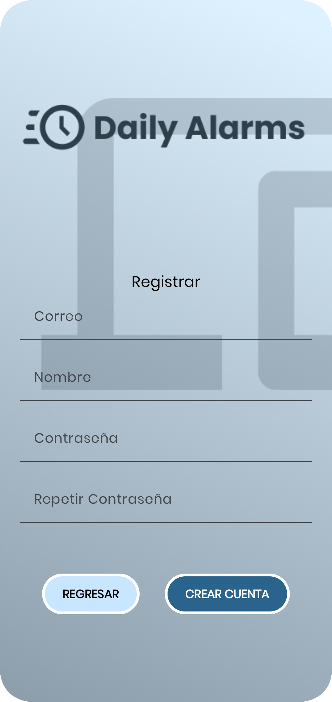
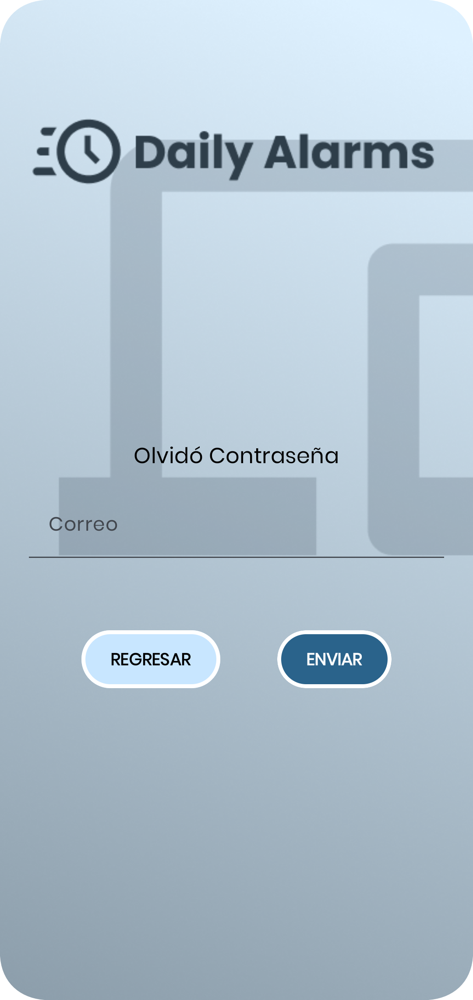
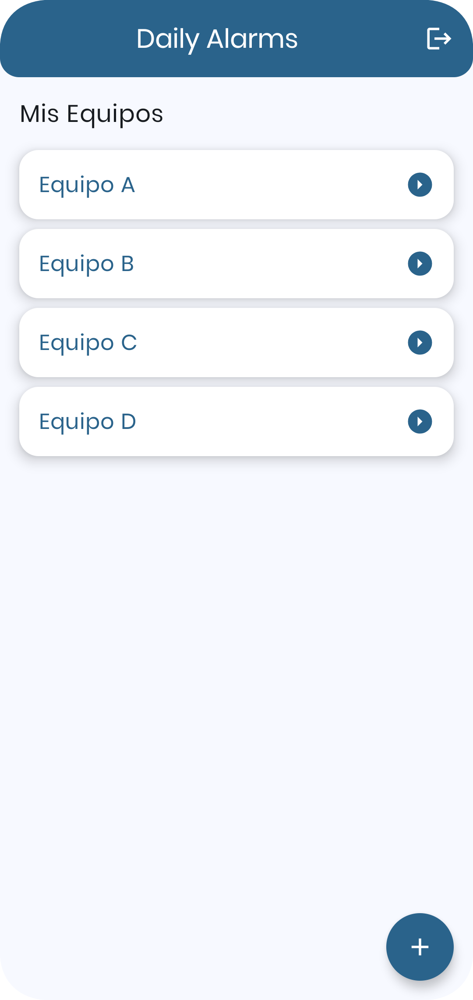

# Daily Alarms - Mobile


<a alt="Nx logo" target="_blank" rel="noreferrer"></a>

Este proyecto es una aplicación móvil desarrollada en Kotlin utilizando Jetpack Compose.


## Estructura del Proyecto

La estructura del proyecto es la siguiente:

```
.editorconfig
.gitignore
gradle/
app/
  src/
    main/
      java/
        com/
          miso/
            dailyalarms/
              ui/
                screens/
                  LoginScreen.kt
  build.gradle
gradle.properties
gradlew
gradlew.bat
settings.gradle
README.md
```

### Descripción de Carpetas

- gradle/: Configuración específica de Gradle.
- app/src/main/java/com/miso/dailyalarms/ui/screens/: Contiene las pantallas de la aplicación, como LoginScreen.kt.

## Instalación

Para instalar las dependencias del proyecto, ejecuta el siguiente comando:

```sh
./gradlew build
```

## Ejecución del Proyecto

Para ejecutar el proyecto en modo desarrollo, utiliza el siguiente comando:

```sh
./gradlew assembleDebug
```

Esto iniciará un servidor de desarrollo y podrás visualizar la aplicación en tu navegador en `http://localhost:4200`.

## Construcción del Proyecto

Para construir el proyecto para producción, utiliza el siguiente comando:

```sh
./gradlew assembleRelease
```

## Vistas Configuradas


- Login
  Login Ruta: app/src/main/java/com/miso/dailyalarms/ui/screens/LoginScreen.kt

  </img>

- Registro
  Registro Ruta: app/src/main/java/com/miso/dailyalarms/ui/screens/RegisterScreen.kt

  </img>

- Olvidé mi Contraseña
  Olvidé mi Contraseña Ruta: app/src/main/java/com/miso/dailyalarms/ui/screens/ForgotPasswordScreen.kt

  </img>

- Lista de Grupos
    Lista de Grupos Ruta: app/src/main/java/com/miso/dailyalarms/ui/screens/GroupsScreen.kt
    
    </img>

## Autor

- [Nicolás Potier](https://github.com/nipoanz)